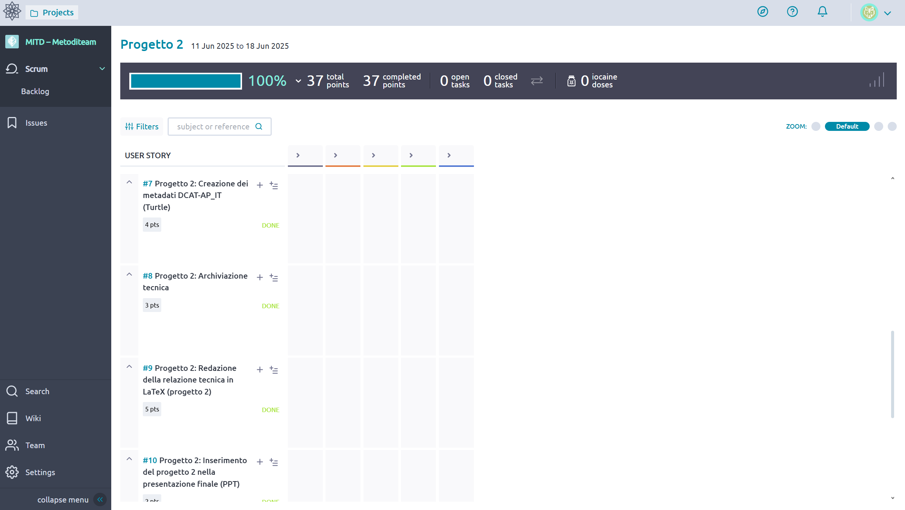

# Italian Healthcare Ontology & RDF Dataset

Ontology modeling, CSV → RDF mapping (YARRRML/RML), and DCAT-AP_IT metadata for an interoperable healthcare dataset of inpatient facilities in Italy.

Course context: Metodi informatici per la trasformazione digitale (AA 2024–2025, University of Bologna).

I acted as Project Manager (PM) for the course backlog and Product Owner (PO) for this project. This deliverable was conceived, implemented, and documented entirely by me (ontology, CSV curation, YARRRML/RML mapping and execution, DCAT-AP_IT metadata, and repository documentation). We were a 4-person team for the course, but my teammates focused on other projects, while I completed this one end-to-end. I tracked the overall backlog in Taiga.

I used Taiga to manage the backlog, sprints, user stories, and acceptance criteria.
Access to the live board is restricted by university SSO, so below are curated screenshots of the process (board, user stories, and story details).

Examples of task tracking in Taiga

Sprint board and user-story flow (Backlog → In progress → Review → Done), with effort points and attachments.

<table> <tr> <td></td> </tr> <tr> <td>
</td> </tr> <tr> <td></td> </tr> <tr> <td></td> </tr> </table>

```
🧭 Repository layout

1. CSV_UTF-8/
└── Progetto2_UTF8.csv                  # Tabular source data (UTF-8, validated)

2. Graffoo Ontologia/
└── ontologia_progetto_2_finale.graffoo # Graffoo diagram (conceptual model)

3. Ontologia fatta con Protege/
├── Ontologia_Turtle.ttl                # Ontology (classes, properties, alignments)
└── OntologyWithInstances_Turtle.ttl    # Ontology + example instances

4. Mappatura YARRRML e output della stessa/
├── YARRRML_Map.yaml                    # CSV→RDF mapping (YARRRML)
└── outputFromYARRRML.ttl               # RDF generated from the CSV (result)

5. Metadataszione/
├── DCAT_AP_IT_Metadata.csv             # Input sheet for metadata
└── DCAT_AP_IT_Metadata.ttl             # Dataset/Distribution metadata (DCAT-AP_IT)
```

